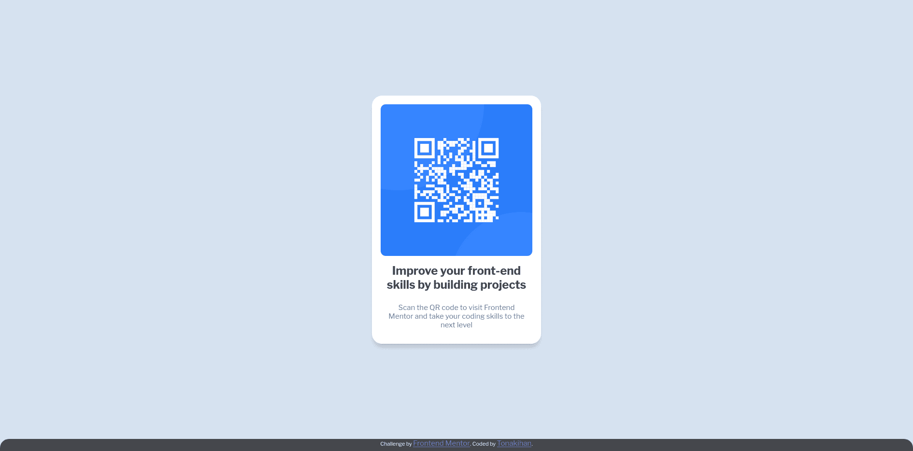

# Frontend Mentor - QR code component solution

This is a solution to the [QR code component challenge on Frontend Mentor](https://www.frontendmentor.io/challenges/qr-code-component-iux_sIO_H). Frontend Mentor challenges help you improve your coding skills by building realistic projects.

## Table of contents

- [Overview](#overview)
  - [Screenshot](#screenshot)
  - [Links](#links)
- [My process](#my-process)
  - [Built with](#built-with)
  - [Useful resources](#useful-resources)
- [Author](#author)

## Overview

### Screenshot

### Links

- Solution URL: [Github](https://github.com/tonakihan/test-qr-code-component)

## My process

### Built with

- Semantic HTML5 markup
- CSS custom properties
- Flexbox

### Useful resources

- [MDN](https://developer.mozilla.org/en-US/docs/Web/CSS/Reference)
- [W3School](https://www.w3schools.com/csS/default.asp)

## Author

- Github - [Tonakihan](https://github.com/tonakihan)
- Frontend Mentor - [@tonakihan](https://www.frontendmentor.io/profile/tonakihan)
